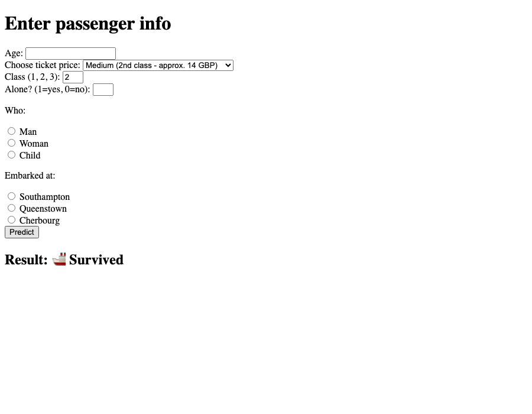

# Titanic Survival Predictor

A small Flask web app that predicts whether a Titanic passenger would have
survived, based on age, ticket fare, class, travel companions, sex/age
group, and port of embarkation. Predictions are made by a
`RandomForestClassifier` (scikit-learn) trained on the classic Titanic
dataset (via `seaborn.load_dataset("titanic")`).

## How it works

- [`model.py`](model.py) trains the model: it loads the Titanic dataset,
  fills missing numeric values, one-hot encodes `sex`, `embarked`, and
  `who`, then runs a `GridSearchCV` over a `StandardScaler` +
  `RandomForestClassifier` pipeline. The best estimator is saved to
  `model.pkl` with `joblib`.
- [`app.py`](app.py) is the Flask app. It loads `model.pkl` and serves a
  form (`templates/index.html`) where a user enters passenger details.
  On submit, the inputs are assembled into a feature vector and passed to
  the model, and the predicted outcome is shown on the page.

## Running it

1. Create and activate a virtual environment (optional but recommended):

   ```bash
   python -m venv .venv
   source .venv/bin/activate
   ```

2. Install dependencies:

   ```bash
   pip install -r requirements.txt
   ```

3. (Optional) Retrain the model — a trained `model.pkl` is already
   included, so this step can be skipped. Requires internet access, since
   it downloads the Titanic dataset via `seaborn.load_dataset`:

   ```bash
   python model.py
   ```

4. Start the web app:

   ```bash
   python app.py
   ```

5. Open [http://127.0.0.1:5000](http://127.0.0.1:5000) in your browser.

## Screenshot


